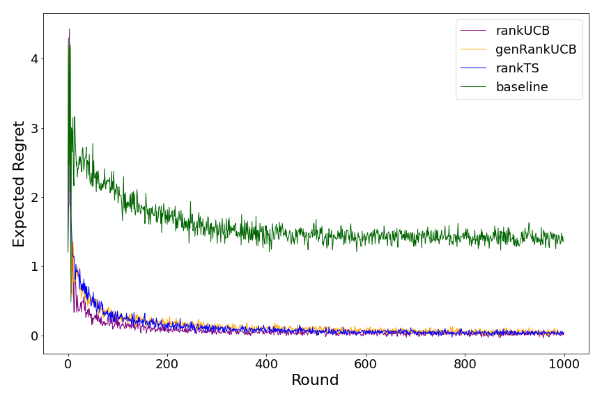
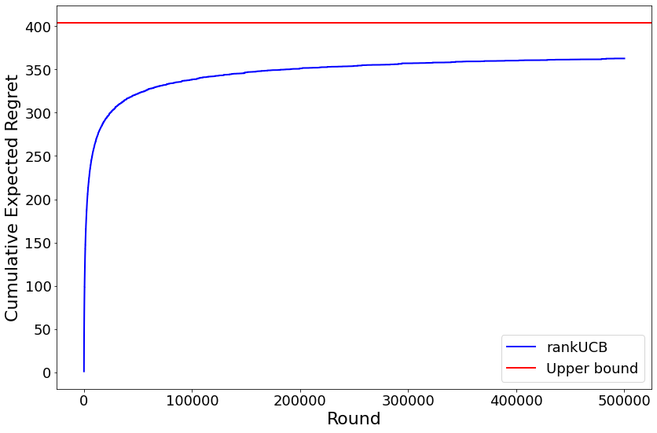

# Ranking in Contextual MAB
This project is for "Ranking in Contextual Multi-armed Bandits".
We study a ranking problem in the contextual multi-armed bandit setting. We model position and item dependencies in the ordered list and design UCB and Thompson Sampling type algorithms for this problem. The algorithms are called rankUCB, genRankUCB and rankTS. This work generalizes existing studies in several directions, including position dependencies where position discount is a particular case.

## Requirements
* Python 3.7 or above
* numpy 1.22.4
* matplotlib 3.5.2
* pandas 1.4.2
* sklearn 1.1.1
* tqdm 4.64.0
* scipy 1.8.1
* multiprocessing 0.70.13

These can be installed using `pip` by running:

```bash
>> pip install -r requirements.txt
```

## Code Usage
The codes in `rankingcontextualmab.py` or `RankingContextualMAB_notebook.ipynb` include the comments for each section to ease the navigation through the codes.

## Example Of The Results

The following figure shows the expected regret when the position dependecy is quite high:


The following figure shows the tightness of the regret bound for rankUCB:

